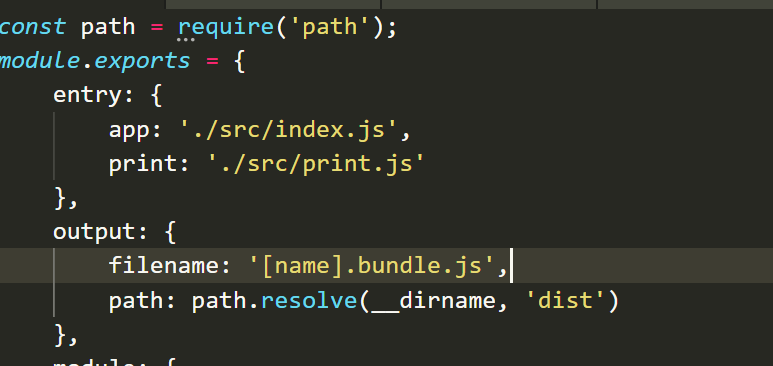
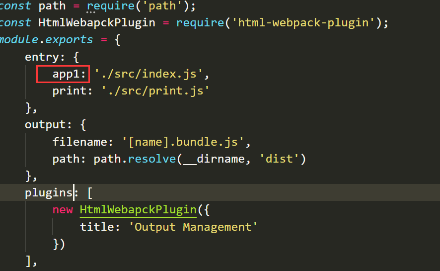
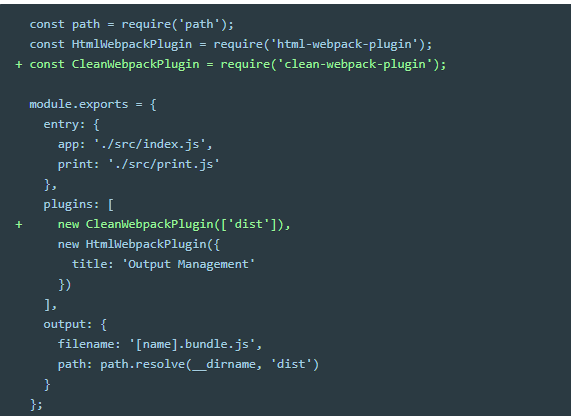
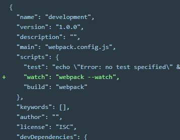
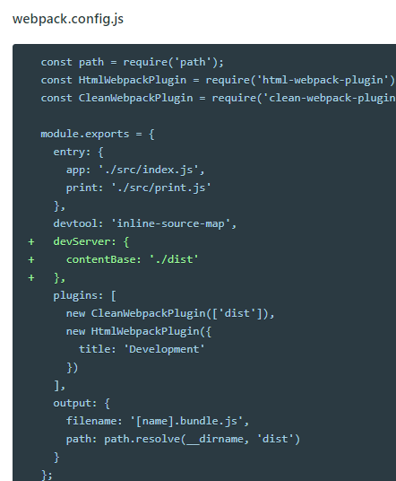

# webpack学习文档
### 首先在项目中安装webpack、webpack-cli
npm install –save-dev webpack
npm install –save-dev webpack-cli
npm install –save(安装一个要打包到生产环境的安装包)
npm install –save-dev(安装一个用于开发的安装包)
### Package.json
{
  "name": "webpack-learn",
  "version": "1.0.0",
  "description": "",
  "private": true, //确保我安装的包是私有的
  "scripts": {
    "test": "echo \"Error: no test specified\" && exit 1",
"start": "webpack --config webpack.config.js",
"build": "webpack" // 现在可以使用npm run build 来打包
  },
  "author": "",
  "license": "ISC",
  "devDependencies": {
    "webpack": "^4.23.1",
    "webpack-cli": "^3.1.2"
  }
}
### Node 8.2+提供了 npx webpack可以打包
ES2015 中的 import 和 export 语句已经被标准化。虽然大多数浏览器还无法支持它们，但是 webpack 却能够提供开箱即用般的支持。
除了import和export以外webpack不会转译其他的ES6语法，所以要安装Babel或者Buble转译器。
### 使用一个配置文件 webpack.config.js
const path = require('path');
module.exports = {
    entry: './src/index.js',
    output: {
        filename: 'bundle.js',
        path: path.resolve(__dirname, 'dist')
    }
}
现在可以使用npx webpack –config webpack.config.js来打包了，npx webpack也可以，它会默认去找名字叫webpack.config.js的文件。但是配置文件名其实可以随意的取名字。npx webpack –config webpack.config.js的—config就是告诉webpack后面的文件是配置文件。
### npm 脚本
安装了webpack-cli就可以使用webpack命令，它可以用来打包，配置选项。每次运行webpack –config webpack-congif.js太麻烦了。可以在package.json中配置npm脚本作为快捷方式。
### 管理资源
管理资源就是loader，css就是’style-loader’, ‘css-loader’, 图片，背景就是’file-loader’。
### 管理输出

入口可以不止一个，这样输出的js文件也不止一个。Index.html里script引入打包后的js文件，这里需要手动引入。如果入口名字变了，打包后的js名字也会变，index.html里又要手动更改引入。所以HtmlWebpackPlugin插件诞生。

运行npm run build

自动生成一个index.html覆盖我们之前的index.html，并且自动引入打包好的js文件。
打包生成的文件都在dist文件夹里，多次打包，就是生成一些不需要的文件，可以使用clean-webpack-plugin插件来在每次打包的时候清理某些文件夹。

到现在为止，我们每修改一下代码就需要npm run build一下。
现在来解决修改代码自动编译。三种方法：
1.	webpack`s Watch Mode
2.	webpack-dev-server
3.	webpack-dev-middleware
第一种：

然后npm run watch,以后改了代码，会自动编译修改后的模块，缺点是浏览器不能自动刷新。
第二种：npm install –save-dev webpack-dev-server

npm run start 就可以实现自动编译和自动刷新。并且项目在localhost:8080访问。

